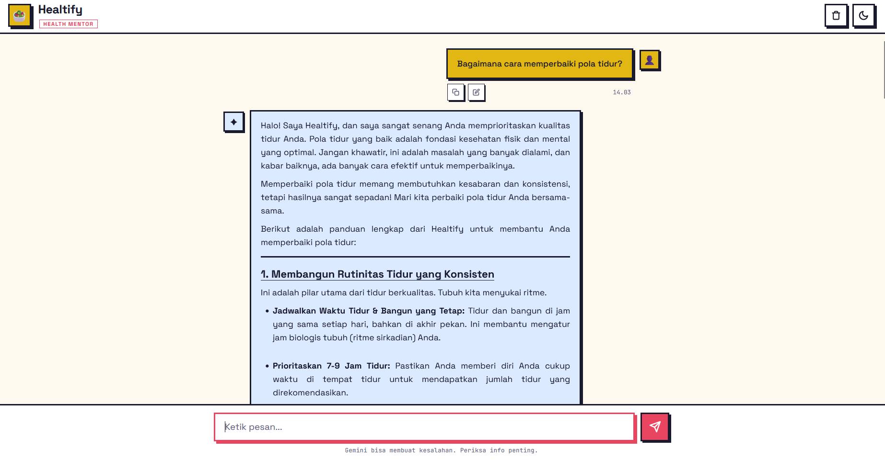

# Healtify - Mentor Kesehatan AI



Proyek ini adalah implementasi chatbot berbasis web yang mengintegrasikan API Google Gemini (Model Gemini 2.5 Flash) sebagai **Mentor Kesehatan Pribadi**. UI (User Interface) didesain menggunakan tema Neo Brutalism.

Proyek ini merupakan hasil implementasi dari materi Sesi 3: AI Productivity and AI API Integration for Developers oleh Hacktiv8.

## Teknologi yang Digunakan

- Backend: Node.js & Express.js.
- Frontend: Vanilla JavaScript (ES6+), Modern CSS (Neo Brutalism Design System), HTML5.
- AI Engine: [Google Generative AI SDK](https://github.com/google/generative-ai-js).
- Konfigurasi: Dotenv untuk manajemen API Key yang aman.

## Prasyarat

- Node.js (v18 atau terbaru)
- npm (Node Package Manager)
- Google Gemini API Key (Dapatkan di Google AI Studio)

## Instalasi dan Setup

1. Clone Repositori
   ```bash
   git clone https://github.com/fritzkmanurung/gemini-chatbot-api.git
   cd gemini-chatbot-api
   ```

2. Instal Dependensi
   ```bash
   npm install
   ```

3. Konfigurasi Environment
   Buat file .env di root direktori proyek:
   ```env
   GEMINI_API_KEY=MASUKKAN_API_KEY_ANDA_DI_SINI
   ```

4. Jalankan Aplikasi
   ```bash
   node index.js
   ```
   Aplikasi akan berjalan di http://localhost:3000.

## Detail Konfigurasi

- Model: gemini-1.5-flash (atau v2.5) dipilih untuk performa latensi rendah yang optimal untuk aplikasi chat.
- System Instruction: AI dikonfigurasi sebagai asisten ramah yang membantu developer dalam tugas-tugas teknis.
- Mode Edit: Menggunakan logika sinkronasi antara UI dan messageHistory untuk memastikan AI selalu merespons sesuai konteks terbaru.

## Lisensi

Proyek ini dikembangkan untuk tujuan edukasi di bawah program AI Opportunity Fund: Asia Pacific yang diselenggarakan oleh Hacktiv8.

Disusun oleh: Fritz Kevin Manurung 
Program: AI Productivity for Developers - Hacktiv8
